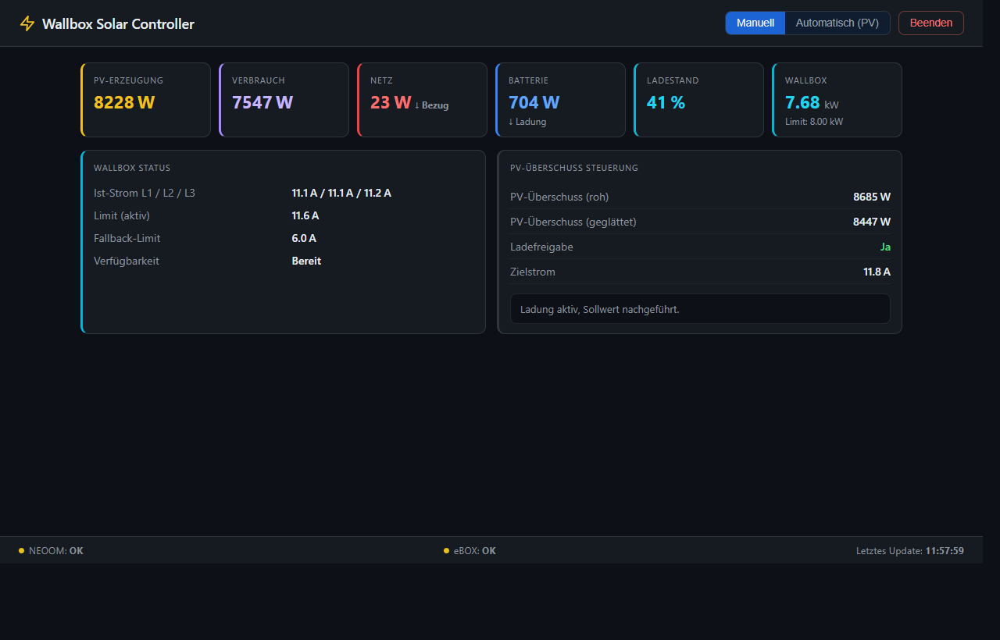

# Wallbox Solar Controller

PV-Überschussladen für die **Compleo eBOX Smart/Professional** mit einem **NEOOM BEAAM**-System. Webbasiertes Dashboard mit automatischem Lastmanagement und manueller Steuerung – gedacht für den Betrieb auf einem Mini-PC im Heimnetz.




---

## Wie es funktioniert

```
NEOOM BEAAM ──HTTP──► Controller (Python) ──Modbus TCP──► Compleo eBOX Smart
                              │
                         FastAPI + SSE
                              │
                   Browser / Android App
```

Alle 30 Sekunden werden die Energiefluss-Daten vom NEOOM-System abgerufen (PV-Produktion, Verbrauch, Netz, Batterie). Im **Automatik-Modus** berechnet der Controller daraus den optimalen Ladestrom und schreibt ihn per Modbus TCP direkt auf die Wallbox. Im **Manuell-Modus** kann der Ladestrom frei über das Web-Interface oder die Android-App gesetzt werden.

### Regellogik (Automatik-Modus)

- **Glättung:** Exponentiell gewichteter Mittelwert verhindert Sprünge durch kurze Wolken
- **Hysterese:** Separater Start- und Stoppschwellwert – kein ständiges Ein-/Ausschalten
- **Rampe:** Maximale Stromänderung pro Zyklus begrenzt (kein harter Sprung)
- **Haltezeit:** Erst nach `N` Zyklen unter der Stoppschwelle wird die Ladung beendet
- **Reserve:** Konfigurierbarer Puffer, der nicht für die Wallbox verwendet wird
- **Feedback-Kompensation:** Der aktuell gesetzte Ladestrom wird beim Lesen des Überschusses wieder hinzuaddiert, da die Wallbox-Last bereits im gemessenen Hausverbrauch enthalten ist.
- **Nahtloser Moduswechsel:** Beim Umschalten von Manuell auf Automatik übernimmt der Controller den aktuell aktiven Ladestrom als Startwert.

---

## Voraussetzungen

### Hardware

| Komponente | Anforderung |
|---|---|
| Compleo eBOX Smart oder Professional | Firmware **≥ 1.3.0** |
| NEOOM BEAAM (Energiemanagementsystem) | API-Zugang (Bearer Token) |
| Mini-PC / Raspberry Pi | Python 3.10+, LAN-Anschluss |
| Netzwerk | Controller, eBOX und BEAAM im gleichen Subnetz |

### Software

```bash
pip install -r requirements.txt
```

Abhängigkeiten: `fastapi`, `uvicorn`, `pyyaml`, `requests`, `pymodbus ≥ 3.0`

---

## Compleo eBOX: Modbus & Lastmanagement einrichten

> **Hinweis:** Ist Modbus einmal aktiviert, ist die Steuerung über die **eCHARGE+ App nicht mehr möglich**. Die Wallbox wird dann ausschließlich über den Modbus-Controller gesteuert.

### Schritt 1 – eBOX ins Heimnetz einbinden (eConfig App)

Die Ersteinrichtung erfolgt über die **Compleo eConfig App** (Bluetooth), nicht über ein direktes LAN-Kabel.

1. **eConfig App** installieren: [iOS](https://apps.apple.com/us/app/econfig/id1455194196) / [Android](https://play.google.com/store/apps/details?id=com.innogy.econfiguration)
2. Bluetooth am Smartphone aktivieren; WLAN und mobile Daten können aktiv bleiben
3. An der eBOX den **Bluetooth-Knopf 3–5 Sekunden** gedrückt halten, bis er blinkt
4. In der eConfig App mit der eBOX verbinden und **PUK** eingeben (Rückseite der Betriebsanleitung)
5. Im Konfigurationsassistenten **WLAN-SSID und Passwort** eintragen (alternativ LAN)
6. **Statische IP-Adresse aktivieren** und eine freie Adresse im Heimnetz vergeben (z. B. `192.168.1.50`)
7. Konfiguration abschließen und speichern

### Schritt 2 – WebConfig aufrufen

Nach der Einrichtung ist die eBOX ganz normal im Heimnetz erreichbar:

1. Browser öffnen: `http://<statische-ip-der-ebox>`
2. Benutzername: **admin**, Passwort: **PUK**

### Schritt 3 – Modbus TCP aktivieren

Im WebConfig-Menü die Modbus-TCP/IP-Kommunikation aktivieren. Die eBOX übernimmt dabei die Rolle des **Slave/Node**.

### Schritt 4 – Lastmanagement konfigurieren

1. Tab **[LDP1 Load Management]** öffnen
2. Feld **„Control Computer"** auf **aktiv** setzen
3. **Fallback-Strom** einstellen (empfohlen: 6–10 A)
4. Einstellungen speichern und eBOX neu starten

#### Offizielle Compleo-Dokumentation

| Dokument | Sprache |
|---|---|
| [eConfig App Bedienungsanleitung](https://www.compleo-charging.com/fileadmin/Documentcenter/eCONFIG_App/DE_eCONFIG_OpMan.pdf) | DE |
| [Quick Guide – Modbus Energiemanagement](https://www.compleo-charging.com/fileadmin/Documentcenter/Modbus_eBOX/DE_Quickguide_eBOX_-_Modbus_Energiemanagement_20230814.pdf) | DE |
| [Quick Guide – Modbus Energy Management](https://www.compleo-charging.com/fileadmin/Documentcenter/Modbus_eBOX/EN_Quickguide_eBOX_-_Modbus_energy_management_20230814.pdf) | EN |
| [WebConfig Bedienungsanleitung](https://www.compleo-charging.com/fileadmin/Documentcenter/WebConfig/DE_WebConfig_OpMan.pdf) | DE |

---

## Installation & Konfiguration (Backend)

### 1. Repository klonen

```bash
git clone https://github.com/marodeur100/wallbox-solar-controller.git
cd wallbox-solar-controller
pip install -r requirements.txt
```

### 2. Konfigurationsdatei anlegen

```bash
cp config.example.yaml config.yaml
```

`config.yaml` bearbeiten:

```yaml
neoom:
  beaam_host: "192.168.x.x"       # IP-Adresse des NEOOM BEAAM
  api_key: "DEIN_API_KEY_HIER"    # Bearer Token (NEOOM-App → Einstellungen → API)

ebox:
  host: "192.168.0.244"           # IP-Adresse der Compleo eBOX
  port: 502                       # Modbus TCP Port (Standard)
  unit_id: 1                      # Modbus Unit ID
  fallback_amps: 6.0              # Sicherheits-Fallback bei Controller-Ausfall

controller:
  reserve_w: 300
  smoothing_alpha: 0.35
  start_margin_w: 500
  stop_margin_w: 700
  stop_hold_cycles: 6
  max_step_a: 1.0

server:
  host: "0.0.0.0"
  port: 8000
  poll_interval_s: 30
```

> `config.yaml` ist in `.gitignore` – Credentials landen nie im Repository.

### 3. Starten

```bash
python main.py
# oder unter Windows:
start.cmd
```

Web-Interface: `http://<ip-des-mini-pc>:8000`

---

## Android App

Die native Android-App ermöglicht die **direkte Modbus-TCP-Steuerung** ohne Browser. Sie kommuniziert direkt mit der eBOX im lokalen Netz – kein Backend nötig.

> **Hinweis:** Wenn der Backend-Controller gleichzeitig im Automatik-Modus läuft, überschreibt er den per App gesetzten Wert beim nächsten Poll-Zyklus. App und Backend nicht gleichzeitig für Schreiboperationen nutzen.

### APK herunterladen & installieren

1. Auf [GitHub Actions → Build Android APK](https://github.com/marodeur100/wallbox-solar-controller/actions/workflows/build-apk.yml) den letzten erfolgreichen Build öffnen
2. Unter **Artifacts** → `wallbox-apk` herunterladen und ZIP entpacken
3. `wallbox-debug.apk` auf das Android-Gerät übertragen
4. Auf dem Gerät: **Einstellungen → Apps → Unbekannte Quellen** erlauben, dann APK installieren

### Einstellungen in der App

| Feld | Beschreibung |
|---|---|
| eBOX IP-Adresse | IP der Wallbox im lokalen Netz (z. B. `192.168.0.244`) |
| Modbus Port | Standard: `502` |
| Modbus Unit ID | Standard: `1` |
| Backend-URL | Optional: URL des laufenden Backends (z. B. `http://192.168.0.10:8000`) – wird vor dem Schreiben automatisch auf Manuell geschaltet |

---

## Projektstruktur

```
wallbox-solar-controller/
├── main.py               # FastAPI-App: Polling-Loop, SSE-Stream, REST-API
├── controller.py         # Regellogik: Überschuss → Ladestrom
├── neoom_client.py       # NEOOM BEAAM HTTP-Client + Metrik-Parser
├── ebox_client.py        # Compleo eBOX Modbus TCP-Client
├── config.example.yaml   # Konfigurationsvorlage
├── requirements.txt
├── start.cmd             # Windows-Startskript
├── mobile_app/
│   ├── main.py           # Android App (Kivy, direkte Modbus-Verbindung)
│   └── buildozer.spec    # Build-Konfiguration für GitHub Actions
└── static/
    ├── index.html        # Web-Dashboard
    └── app.html          # Mobile PWA (Alternative zur nativen App)
```

---

## Modbus-Register der eBOX (Referenz)

| Register | Typ | Funktion | Zugriff |
|---|---|---|---|
| 1006 / 1008 / 1010 | FLOAT32 | Ist-Strom L1 / L2 / L3 (A) | **Input Register (FC4)** – nur lesen |
| 1012 / 1014 / 1016 | FLOAT32 | MaxCurrentPhase L1 / L2 / L3 – aktives Limit (A) | Holding Register (FC3) – lesen/schreiben |
| 1018 / 1020 / 1022 | FLOAT32 | FallbackMaxCurrent L1 / L2 / L3 (A) | Holding Register (FC3) – lesen/schreiben |
| 1028 | UINT16 | Verfügbarkeit (1 = Bereit) | Holding Register (FC3) – nur lesen |

FLOAT32-Werte belegen je zwei aufeinanderfolgende Register (Big-Endian). Schreiboperationen setzen alle drei Phasen-Register in einer einzigen Modbus-Transaktion.

> **Wichtig:** Die Ist-Strom-Register (1006/1008/1010) sind **Input Registers (FC4)**, nicht Holding Registers (FC3). Ein Leseversuch mit FC3 liefert `exception_code=2`.

---

## API-Endpunkte

| Methode | Pfad | Beschreibung |
|---|---|---|
| `GET` | `/` | Web-Dashboard |
| `GET` | `/api/state` | Aktueller Zustand als JSON |
| `GET` | `/api/stream` | Server-Sent Events (Live-Updates) |
| `POST` | `/api/mode` | Modus setzen: `{"mode": "auto"}` oder `{"mode": "manual"}` |
| `POST` | `/api/manual` | Ladestrom setzen: `{"amps": 10.5}` (0–16 A) |
| `POST` | `/api/shutdown` | Controller beenden |

---

## Autostart (systemd, Linux/Mini-PC)

```ini
# /etc/systemd/system/wallbox-controller.service
[Unit]
Description=Wallbox Solar Controller
After=network.target

[Service]
WorkingDirectory=/opt/wallbox-solar-controller
ExecStart=/usr/bin/python3 main.py
Restart=always
RestartSec=10

[Install]
WantedBy=multi-user.target
```

```bash
sudo systemctl enable --now wallbox-controller
```

---

## Hinweise

- Die eBOX Smart wird seit März 2023 nicht mehr produziert; die eBOX Professional ist der Nachfolger und verwendet das gleiche Modbus-Interface.
- Der NEOOM API-Key ist in der NEOOM-App unter **Einstellungen → Integrationen → API** zu finden.
- Minimaler Ladestrom der eBOX ist 6 A (dreiphasig = 4 140 W).

---

## Lizenz

MIT
